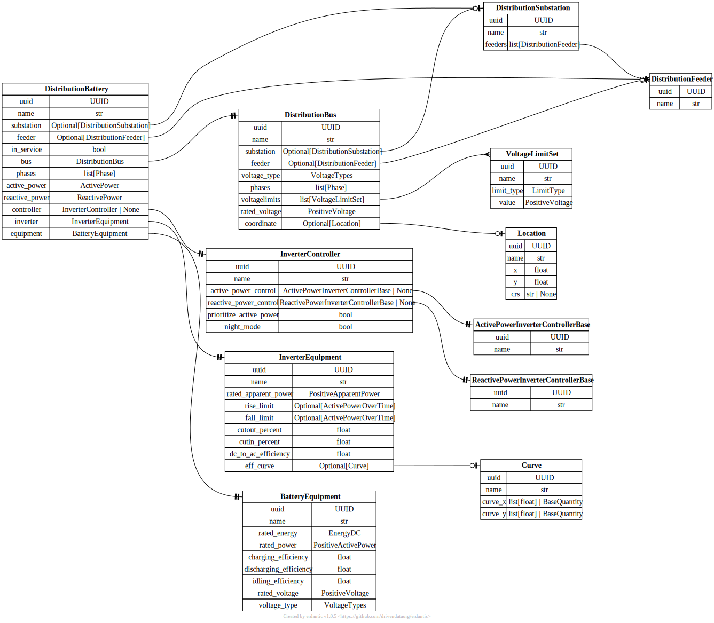

# Distribution Battery

[](../../models/DistributionBattery.svg)

```{eval-rst}
.. autopydantic_model:: gdm.distribution.components.DistributionBattery
   :members: __init__
   :inherited-members: Component
   :exclude-members: example, validate_fields
   :model-erdantic-figure: True
```