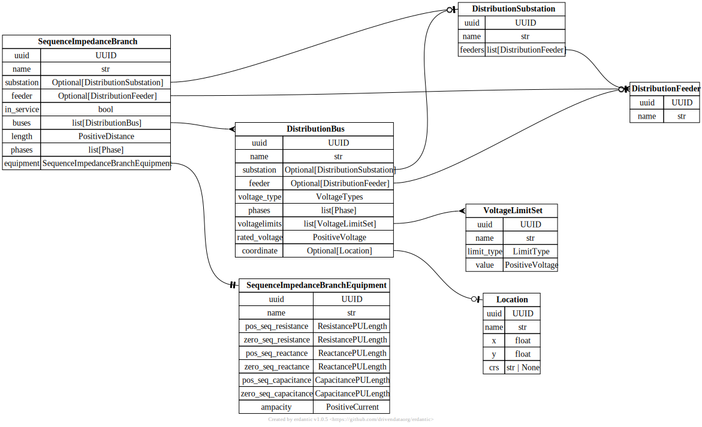
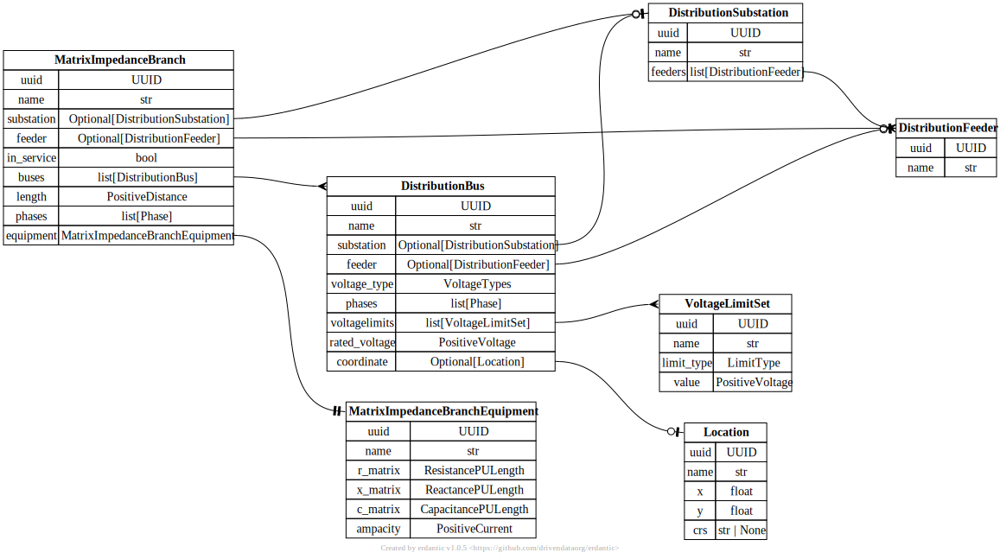
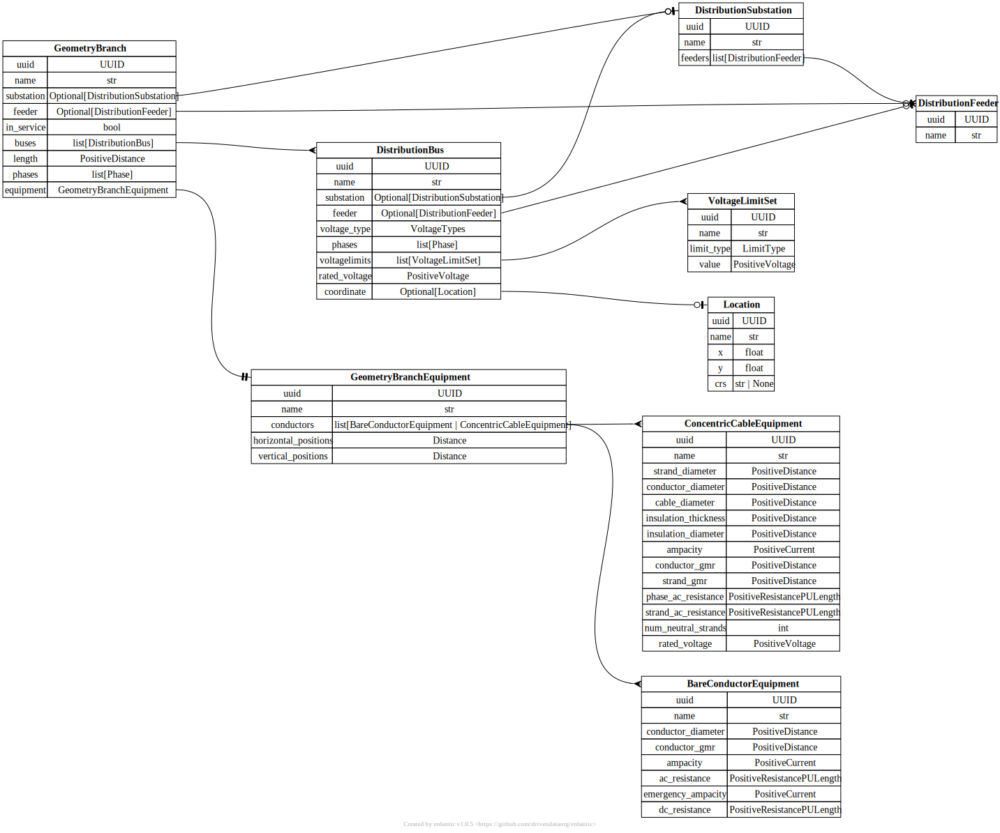

# Distribution Branch

[](../../models/SequenceImpedanceBranch.svg)

```{eval-rst}
.. autopydantic_model:: gdm.SequenceImpedanceBranch
   :members: 
   :inherited-members: Component
   :exclude-members: example, validate_fields
```

[](../../models/MatrixImpedanceBranch.svg)

```{eval-rst}
.. autopydantic_model:: gdm.MatrixImpedanceBranch
   :members: 
   :inherited-members: Component
   :exclude-members: example, validate_fields
```

[](../../models/GeometryBranch.svg)

```{eval-rst}
.. autopydantic_model:: gdm.GeometryBranch
   :members: __init__
   :inherited-members: Component
   :exclude-members: example, validate_fields
```