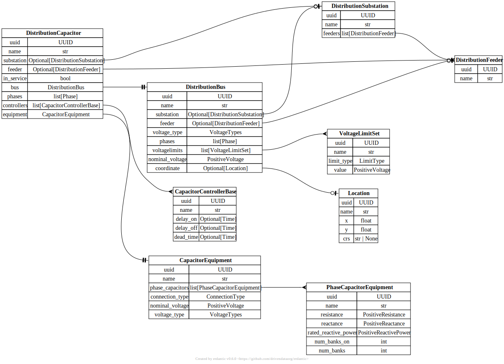

# Distribution Capacitor

[](../../models/DistributionCapacitor.svg)

```{eval-rst}
.. autopydantic_model:: gdm.DistributionCapacitor
   :members: 
   :inherited-members: Component
   :exclude-members: example, validate_fields
```
