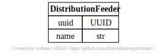

# Distribution Feeder

[](../../models/DistributionFeeder.svg)

```{eval-rst}
.. autopydantic_model:: gdm.DistributionFeeder
   :members: 
   :inherited-members: Component
   :exclude-members: example, validate_fields
```