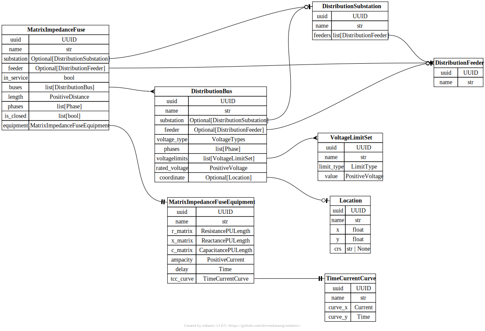

# Distribution Fuse 

[](../../models/MatrixImpedanceFuse.svg)

```{eval-rst}
.. autopydantic_model:: gdm.distribution.components.MatrixImpedanceFuse
   :members: __init__
   :inherited-members: Component
   :exclude-members: example, validate_fields
```