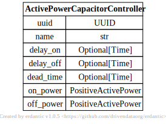
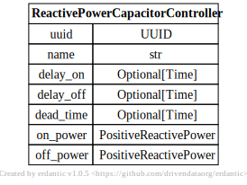
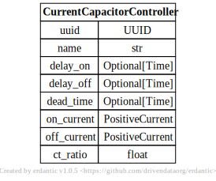
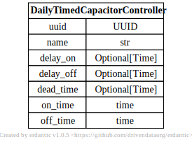

# Capacitor Controllers

[](../../models/VoltageCapacitorController.svg)

```{eval-rst}
.. autopydantic_model:: gdm.VoltageCapacitorController
   :members: __init__
   :inherited-members: Component
   :exclude-members: example, validate_fields
```

[](../../models/ActivePowerCapacitorController.svg)

```{eval-rst}
.. autopydantic_model:: gdm.ActivePowerCapacitorController
   :members: __init__
   :inherited-members: Component
   :exclude-members: example, validate_fields
```

[](../../models/ReactivePowerCapacitorController.svg)

```{eval-rst}
.. autopydantic_model:: gdm.ReactivePowerCapacitorController
   :members: __init__
   :inherited-members: Component
   :exclude-members: example, validate_fields
```

[](../../models/CurrentCapacitorController.svg)

```{eval-rst}
.. autopydantic_model:: gdm.CurrentCapacitorController
   :members: __init__
   :inherited-members: Component
   :exclude-members: example, validate_fields
```

[](../../models/DailyTimedCapacitorController.svg)

```{eval-rst}
.. autopydantic_model:: gdm.DailyTimedCapacitorController
   :members: __init__
   :inherited-members: Component
   :exclude-members: example, validate_fields
```