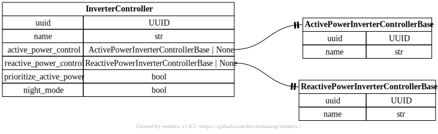
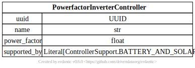
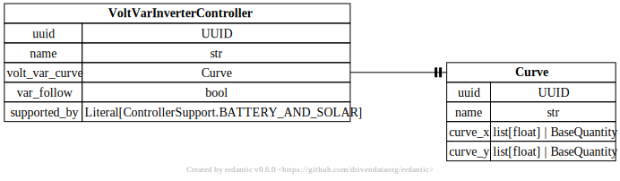
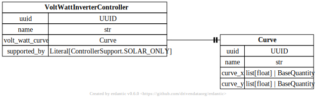
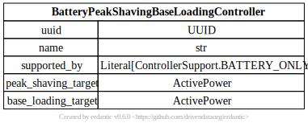
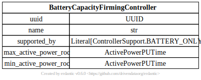
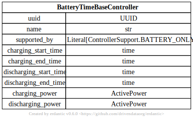
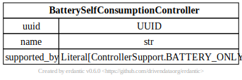
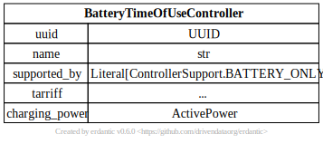
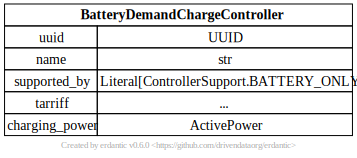

# Inverter Controller

[](../../models/InverterController.svg)

```{eval-rst}
.. autopydantic_model:: gdm.InverterController
   :members: __init__
   :inherited-members: Component
   :exclude-members: example, validate_fields
```

## Reactive Power Controls

[](../../models/PowerfactorInverterController.svg)

```{eval-rst}
.. autopydantic_model:: gdm.PowerfactorInverterController
   :members: __init__
   :inherited-members: Component
   :exclude-members: example, validate_fields
```

[](../../models/VoltVarInverterController.svg)

```{eval-rst}
.. autopydantic_model:: gdm.VoltVarInverterController
   :members: __init__
   :inherited-members: Component
   :exclude-members: example, validate_fields
```

## Active Power Controls

[](../../models/VoltWattInverterController.svg)

```{eval-rst}
.. autopydantic_model:: gdm.VoltWattInverterController
   :members: __init__
   :inherited-members: Component
   :exclude-members: example, validate_fields
```

[](../../models/BatteryPeakShavingBaseLoadingController.svg)

```{eval-rst}
.. autopydantic_model:: gdm.BatteryPeakShavingBaseLoadingController
   :members: __init__
   :inherited-members: Component
   :exclude-members: example, validate_fields
```

[](../../models/BatteryCapacityFirmingController.svg)

```{eval-rst}
.. autopydantic_model:: gdm.BatteryCapacityFirmingController
   :members: __init__
   :inherited-members: Component
   :exclude-members: example, validate_fields
```

[](../../models/BatteryTimeBaseController.svg)

```{eval-rst}
.. autopydantic_model:: gdm.BatteryTimeBaseController
   :members: __init__
   :inherited-members: Component
   :exclude-members: example, validate_fields
```

[](../../models/BatterySelfConsumptionController.svg)

```{eval-rst}
.. autopydantic_model:: gdm.BatterySelfConsumptionController
   :members: __init__
   :inherited-members: Component
   :exclude-members: example, validate_fields
```

[](../../models/BatteryTimeOfUseController.svg)

```{eval-rst}
.. autopydantic_model:: gdm.BatteryTimeOfUseController
   :members: __init__
   :inherited-members: Component
   :exclude-members: example, validate_fields
```

[](../../models/BatteryDemandChargeController.svg)

```{eval-rst}
.. autopydantic_model:: gdm.BatteryDemandChargeController
   :members: __init__
   :inherited-members: Component
   :exclude-members: example, validate_fields
```