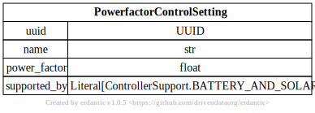
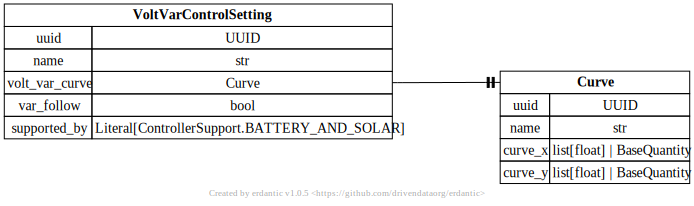
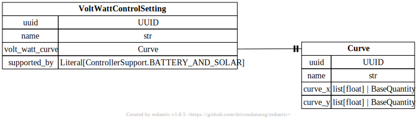
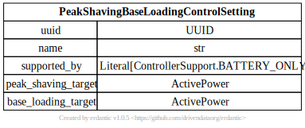
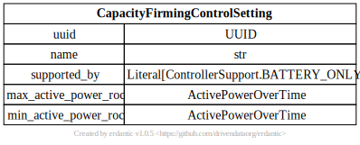
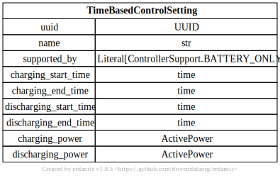
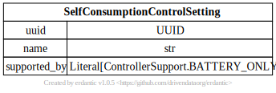
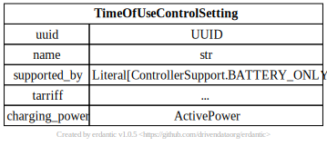
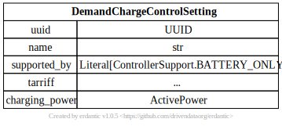

# Inverter Controller

[](../../models/InverterController.svg)

```{eval-rst}
.. autopydantic_model:: gdm.distribution.controllers.InverterController
   :members: __init__
   :inherited-members: Component
   :exclude-members: example, validate_fields
```

## Reactive Power Controls

[](../../models/PowerfactorControlSetting.svg

```{eval-rst}
.. autopydantic_model:: gdm.distribution.controllers.PowerfactorControlSetting
   :members: __init__
   :inherited-members: Component
   :exclude-members: example, validate_fields
```

[](../../models/VoltVarControlSetting.svg)

```{eval-rst}
.. autopydantic_model:: gdm.distribution.controllers.VoltVarControlSetting
   :members: __init__
   :inherited-members: Component
   :exclude-members: example, validate_fields
```

## Active Power Controls

[](../../models/VoltWattControlSetting.svg)

```{eval-rst}
.. autopydantic_model:: gdm.distribution.controllers.VoltWattControlSetting
   :members: __init__
   :inherited-members: Component
   :exclude-members: example, validate_fields
```

[](../../models/PeakShavingBaseLoadingControlSetting.svg)

```{eval-rst}
.. autopydantic_model:: gdm.distribution.controllers.PeakShavingBaseLoadingControlSetting
   :members: __init__
   :inherited-members: Component
   :exclude-members: example, validate_fields
```

[](../../models/CapacityFirmingControlSetting.svg)

```{eval-rst}
.. autopydantic_model:: gdm.distribution.controllers.CapacityFirmingControlSetting
   :members: __init__
   :inherited-members: Component
   :exclude-members: example, validate_fields
```

[](../../models/TimeBasedControlSetting.svg)

```{eval-rst}
.. autopydantic_model:: gdm.distribution.controllers.TimeBasedControlSetting
   :members: __init__
   :inherited-members: Component
   :exclude-members: example, validate_fields
```

[](../../models/SelfConsumptionControlSetting.svg)

```{eval-rst}
.. autopydantic_model:: gdm.distribution.controllers.SelfConsumptionControlSetting
   :members: __init__
   :inherited-members: Component
   :exclude-members: example, validate_fields
```

[](../../models/TimeOfUseControlSetting.svg)

```{eval-rst}
.. autopydantic_model:: gdm.distribution.controllers.TimeOfUseControlSetting
   :members: __init__
   :inherited-members: Component
   :exclude-members: example, validate_fields
```

[](../../models/DemandChargeControlSetting.svg)

```{eval-rst}
.. autopydantic_model:: gdm.distribution.controllers.DemandChargeControlSetting
   :members: __init__
   :inherited-members: Component
   :exclude-members: example, validate_fields
```