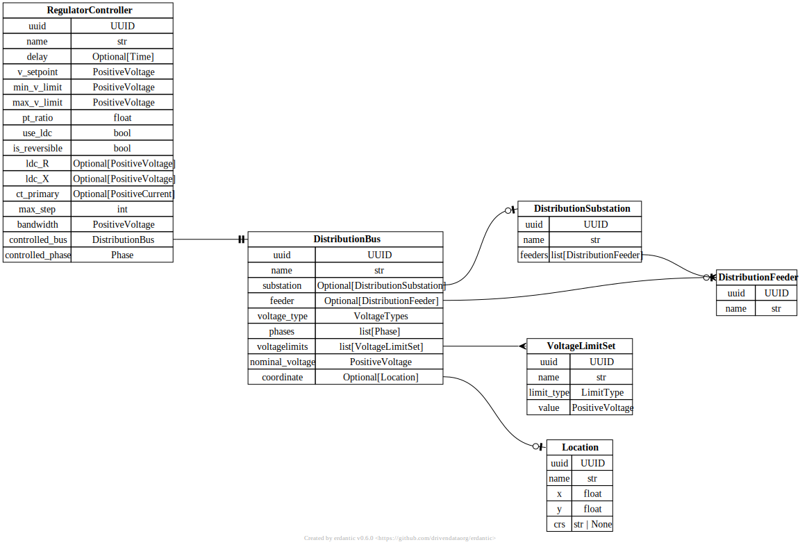

# Regulator Controller

[](../../models/RegulatorController.svg)

```{eval-rst}
.. autopydantic_model:: gdm.distribution.controllers.RegulatorController
   :members: __init__
   :inherited-members: Component
   :exclude-members: example, validate_fields
```
