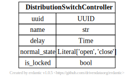

# Switch Controller

[](../../models/DistributionSwitchController.svg)

```{eval-rst}
.. autopydantic_model:: gdm.DistributionSwitchController
   :members: __init__
   :inherited-members: Component
   :exclude-members: example, validate_fields
```
