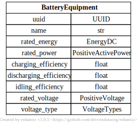

# Battery Equipment

[](../../models/BatteryEquipment.svg) 

```{eval-rst}
.. autopydantic_model:: gdm.BatteryEquipment
   :members: __init__
   :inherited-members: Component
   :exclude-members: example, validate_fields
```