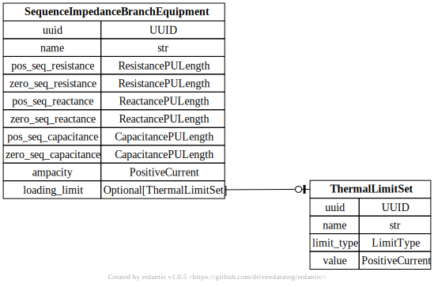
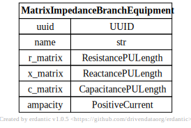
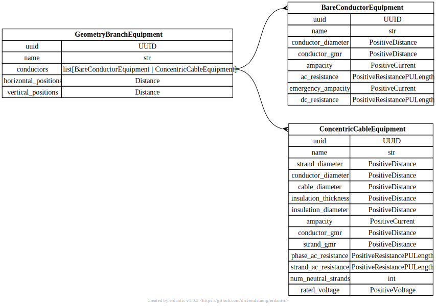

# Distribution Branch Equipment

[](../../models/SequenceImpedanceBranchEquipment.svg) 

```{eval-rst}
.. autopydantic_model:: gdm.distribution.equipment.SequenceImpedanceBranchEquipment
   :exclude-members: example, validate_fields
```

[](../../models/MatrixImpedanceBranchEquipment.svg) 

```{eval-rst}
.. autopydantic_model:: gdm.distribution.equipment.MatrixImpedanceBranchEquipment
   :exclude-members: example, validate_fields
```

[](../../models/GeometryBranchEquipment.svg) 

```{eval-rst}
.. autopydantic_model:: gdm.distribution.equipment.GeometryBranchEquipment
   :exclude-members: example, validate_fields
```