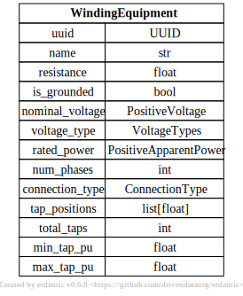
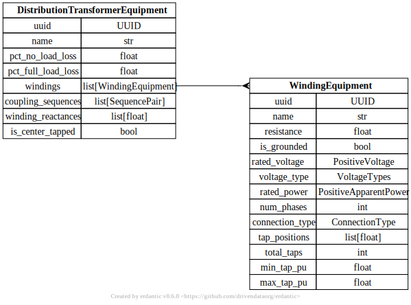

# Distribution Transformer Equipment


[](../../models/WindingEquipment.svg) 

```{eval-rst}
.. autopydantic_model:: gdm.WindingEquipment
   :members: __init__
   :inherited-members: Component
   :exclude-members: example, validate_fields
```


[](../../models/DistributionTransformerEquipment.svg) 

```{eval-rst}
.. autopydantic_model:: gdm.DistributionTransformerEquipment
   :members: __init__
   :inherited-members: Component
   :exclude-members: example, validate_fields
```