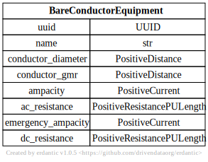
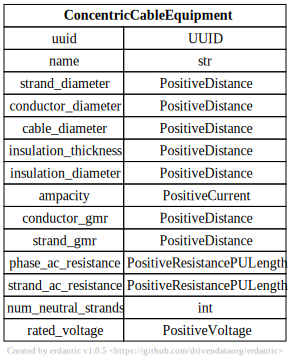

# Wire Equipment

[](../../models/BareConductorEquipment.svg) 

```{eval-rst}
.. autopydantic_model:: gdm.BareConductorEquipment
   :members: __init__
   :inherited-members: Component
   :exclude-members: example, validate_fields
```

[](../../models/ConcentricCableEquipment.svg) 

```{eval-rst}
.. autopydantic_model:: gdm.ConcentricCableEquipment
   :members: __init__
   :inherited-members: Component
   :exclude-members: example, validate_fields
```