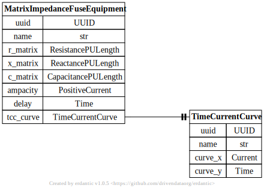

# Fuse Equipment

[](../../models/MatrixImpedanceFuseEquipment.svg)

```{eval-rst}
.. autopydantic_model:: gdm.distribution.equipment.MatrixImpedanceFuseEquipment
   :members: __init__
   :inherited-members: Component
   :exclude-members: example, validate_fields
```