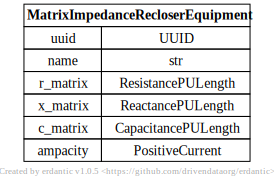
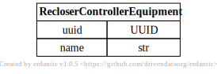

# Recloser Equipment

[](../../models/MatrixImpedanceRecloserEquipment.svg)

```{eval-rst}
.. autopydantic_model:: gdm.MatrixImpedanceRecloserEquipment
   :members: __init__
   :inherited-members: Component
   :exclude-members: example, validate_fields
```

[](../../models/RecloserControllerEquipment.svg)

```{eval-rst}
.. autopydantic_model:: gdm.RecloserControllerEquipment
   :members: __init__
   :inherited-members: Component
   :exclude-members: example, validate_fields
```