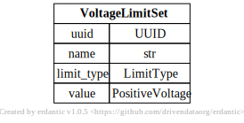
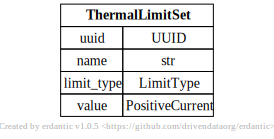

# Distribution Limitsets

[](../models/VoltageLimitSet.svg)

```{eval-rst}
.. autopydantic_model:: gdm.distribution.common.VoltageLimitSet
   :members: __init__
   :inherited-members: Component
   :exclude-members: example, validate_fields
```

[](../models/ThermalLimitSet.svg)

```{eval-rst}
.. autopydantic_model:: gdm.distribution.common.ThermalLimitSet
   :members: __init__
   :inherited-members: Component
   :exclude-members: example, validate_fields
```