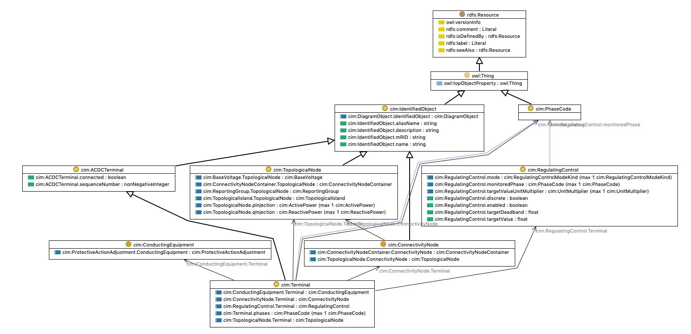

# Terminal in CIM vs DistributionBus in GDM

Figure below shows an UML diagram for `Terminal` and `ConnectivityNode` in Common Information Model (CIM) which is used to connect terminals of 
ac conducting equipment which is analogous to `DistributionBus` in grid data models. [The CIM diagram is accessed from here.](https://ontology.tno.nl/IEC_CIM/cim_Terminal.html). `Terminal` class inherits from `IdentifiedObject` class which has `name`, `description` and `mrid`. `IdentifiedObject.mrid` is analogous to `ComponentWithQuantities.uuid`. Note in GDM we also have `system_uuid` to sort of manage which system these assets belong to. Also `DistributionBus` has `coordinate` attribute of type `Location` which is equivalent to `PositionPoint` in CIM. 


| GDM | CIM | Note |
|-----|-----|------|
|`ComponentWithQuantities.name`| `cim:IdentifiedObject.name`| Both of them are string. |
| `ComponentWithQuantities.uuid` | `cim:IdentifiedObject.mrid` | Unique identifier for the component. |
| `ComponentWithQuantities.system_uuid` | N/A | System UUID to which this component belongs to. |
| `PowerSystemBus.nominal_voltage` | `cim:BaseVoltage.nominalVoltage` | Note nominal voltage is unit aware but BaseVoltage is not. |
| `Location.x` | `cim:PositionPoint.xPosition` | x coordinate of the component. |
| `Location.y` | `cim:PositionPoint.yPosition` | y coordinate of the component |
| `Location.crs` | N/A | Coordinate reference system for geo coordinates. |
| `DistributionBus.voltage_type` | N/A | Differentiates from line to line voltage to line to ground voltage |
| `DistributionComponent.feeder` |  | Name of the feeder to which this component belong to|
| `DistributionComponent.substation` |  | Name of the substation to which this component belongs to. |
| `DistributionBus.phases` | `cim:Terminal.phases`| List of phases.| 
| `VoltageLimitSet.type` | | Limit type min or max |
| `VoltageLimitSet.value` | | Value for limit. |



Here is an UML diagram of `DistributionBus` from Grid data models.

```{mermaid}

    classDiagram

      class ComponentWithQuantities
      ComponentWithQuantities: +name str 
      ComponentWithQuantities: +uuid UUID
      ComponentWithQuantities: +system_uuid UUID | None

      class PowerSystemBus
      PowerSystemBus: +nominal_voltage PositiveVoltage
      PowerSystemBus: +coordinate Location | None

      class Location
      Location: +x float
      Location: +y float 
      Location: +crs str | None

      class DistributionBus
      DistributionBus: +voltage_type VoltageTypes
      DistributionBus: +belongs_to DistributionComponent | None 
      DistributionBus: +phases list[Phase]
      DistributionBus: +voltagelimits list[VoltageLimitSet]

      class VoltageTypes{
        <<enumeration>>
        LINE_TO_LINE
        LINE_TO_GROUND
      }

      class DistributionComponent
      DistributionComponent: +feeder str
      DistributionComponent: +substation str

      class Phase{
        <<enumeration>>
        A
        B
        C
        N
        s1
        s2
      }

      class VoltageLimitSet
      VoltageLimitSet: +limit_type LimitType
      VoltageLimitSet: +value PositiveVoltage

      class LimitType{
        <<enumerations>>
        MIN
        MAX
      }

      PowerSystemBus --|> ComponentWithQuantities
      Location --* PowerSystemBus
      DistributionBus --|> PowerSystemBus
      DistributionComponent <-- DistributionBus
      VoltageLimitSet "0..*" --> "1" DistributionBus
```
