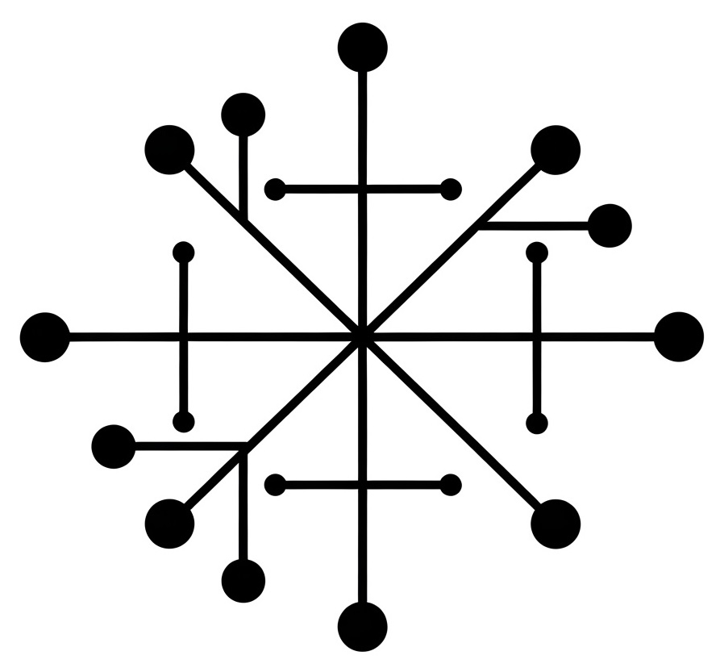

<div align="center">
  
</div>


# Grid Data Models (GDM)

GDM is a python package containing data models for power system assets and datasets. This package is actively being developed at [National Renewable Energy Laboratory (NREL)](https://www.nrel.gov/).

## Installation

You can install latest version of `grid-data-models` from PyPi.

```bash
pip install grid-data-models
```


## Why Grid Data Models ?

In an effort to reduce code duplication and provide client packages a standard interface to interact with power system data, a group of research engineers at NREL is working on developing standard data models. Features:

- **Built-in validation layer:** Use of [pydantic](https://docs.pydantic.dev/latest/) allows us to validate model fields.
- **Connectivity Validation**: Ensures logical consistency in grid design, e.g.:
  - Three-phase equipment cannot connect to single-phase buses.
  - Transformer low-voltage sides cannot connect to high-voltage buses.
- **Time series data management:** GDM uses [infrasys](https://github.nrel.gov/CADET/infrastructure_systems) package which enables [efficient time series data management](https://nrel.github.io/infrasys/explanation/time_series.html) by sharing arrays across components and offloading system memory. For example, we can attach time series power consumption data to a load profile.
- **Built-in unit conversion:** GDM leverages [pint](https://pint.readthedocs.io/en/stable/) for unit conversion for power system quantities. For e.g power, voltage, time etc.
- **JSON serialization/deserialization:** GDM uses [infrasys](https://github.nrel.gov/CADET/infrastructure_systems) to serialize and deserialize distribution system components to/from JSON.
- **Temporal Modeling**: Supports [temporal changes](#temporal-changes)  within a distribution model, enabling enhanced scenaio management capabilities.
- **Graph-Based Analysis**: Exposes a connectivity graph using **NetworkX**, allowing advanced graph-based algorithms and visualizations.
- **Interoperability**: Easily integrates with existing tools.
- **Model reduction**: Built-in support for multiple model reduction algorithms.

## How to get started ?

To get started, you can clone and pip install this library from [here](https://github.nrel.gov/CADET/grid-data-models).


## Contributors

- **Aadil Latif**
- **Kapil Duwadi**
- **Tarek Elgindy**
- **Pedro Andres Sanchez Perez**
- **Daniel Thom**
- **Jeremy Keen**


```{toctree}
:caption: API Documentation
:hidden: true

api/index
```

```{toctree}
:caption: CIM & GDM
:hidden: true

cim/index
```


```{toctree}
:caption: Usage
:hidden: true

usage/index
```

```{toctree}
:caption: CLI
:hidden: true

cli/index
```